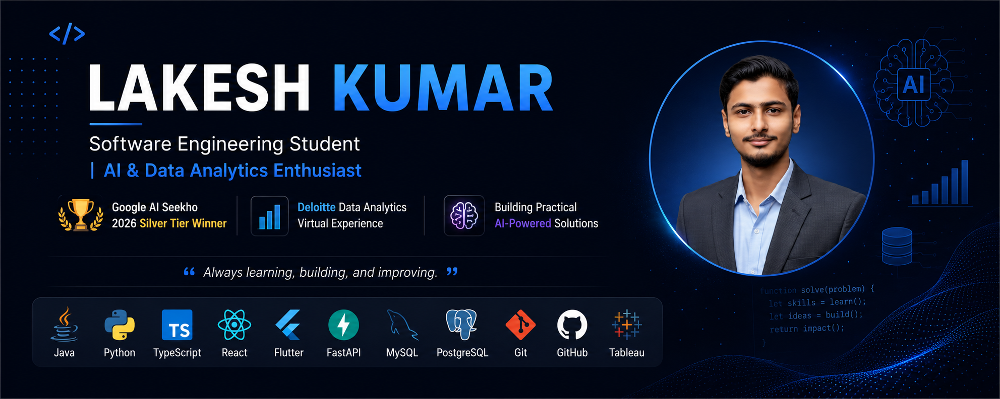

  

# 👋 Hi, I'm Lakesh Kumar

🚀 **Software Engineering Student | AI & Data Analytics Enthusiast**

🏆 Google AI Seekho 2026 Silver Tier Winner
📊 Deloitte Data Analytics Virtual Experience
💡 Building practical AI-powered solutions and modern web applications

---

## 🧑‍💻 About Me

* 🎓 BS Software Engineering student at Sukkur IBA University
* 🤖 Passionate about Artificial Intelligence, Data Analytics, and Software Development
* 🚀 Enjoy building projects that solve real-world problems
* 📈 Continuously improving through projects, hackathons, internships, and certifications
* 🌱 Exploring AI, Cloud Technologies, and Modern Development Tools

---

## 🏆 Achievements

* 🥈 Silver Tier Winner — Google AI Seekho 2026
* 🤖 Developed multiple AI-powered applications using Google Gemini
* 📊 Completed Deloitte Data Analytics Virtual Experience
* 🚀 Participated in AI Seekho 2026 Hackathon
* 💻 Built and deployed full-stack and AI-powered projects

---

## 🛠️ Tech Stack

### Languages

### Frameworks & Tools

---

## 🚀 Featured Projects

### 🤖 StudyAI Pro — Silver Tier Winner

AI-powered study assistant that transforms notes into:

* Smart Summaries
* Flashcards
* Quizzes
* Study Plans
* Mind Maps
* AI Tutor

**Tech:** Google Gemini, Generative AI, Cloud Run, EdTech

---

### 🚨 CIRO — Crisis Intelligence & Response Orchestrator

AI-powered crisis intelligence and emergency response platform developed during the AI Seekho Hackathon.

**Tech:** Flutter, FastAPI, Python, Google Gemini, Google Cloud Platform

---

### 📄 CV Builder

Professional resume creation platform featuring:

* AI-powered Auto-Fill
* ATS Score Analysis
* Live Resume Preview
* Multi-format Export (PDF, DOCX, PNG, TXT)

**Tech:** React, TypeScript

🔗 Live Demo: https://lakeshkumar.vercel.app/cv-builder

---

### 📚 Library Management System

Desktop-based library management solution with:

* Book Tracking
* User Management
* Record Handling
* Database Search

**Tech:** Java Swing, JDBC, MySQL

---

## 📜 Certifications

* Intermediate SQL — DataCamp
* Intermediate Python — DataCamp
* Core Java Specialization — LearnQuest
* Java Data Structures & Algorithms Specialization — Codio

---

## 📈 GitHub Activity

---

## 🌐 Connect With Me

* 💼 LinkedIn: https://linkedin.com/in/lakesh-kumar
* 🌍 Portfolio: https://lakeshkumar.vercel.app
* 💻 GitHub: https://github.com/lakeshkumarkhatri
* 📧 Email: [lakeshkumarkhatri7@gmail.com](mailto:lakeshkumarkhatri7@gmail.com)

---

### 💭 Motto

> "Always learning, building, and improving."
